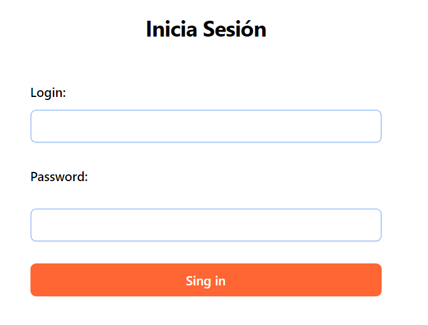
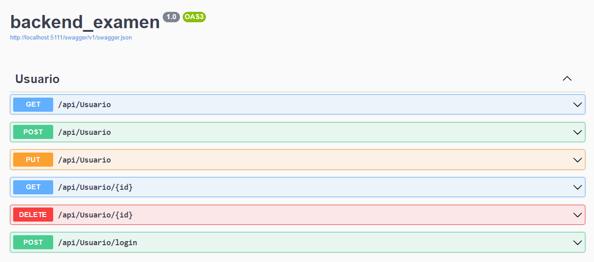
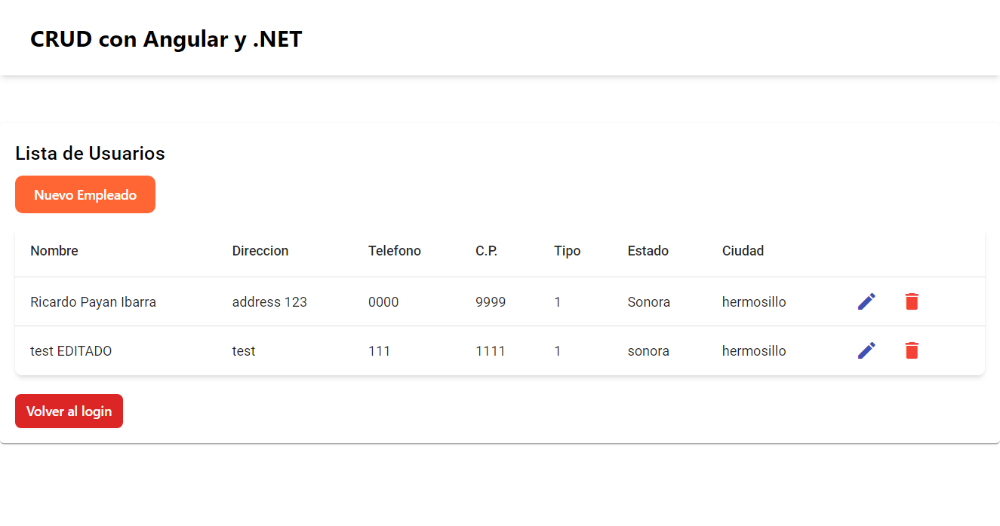
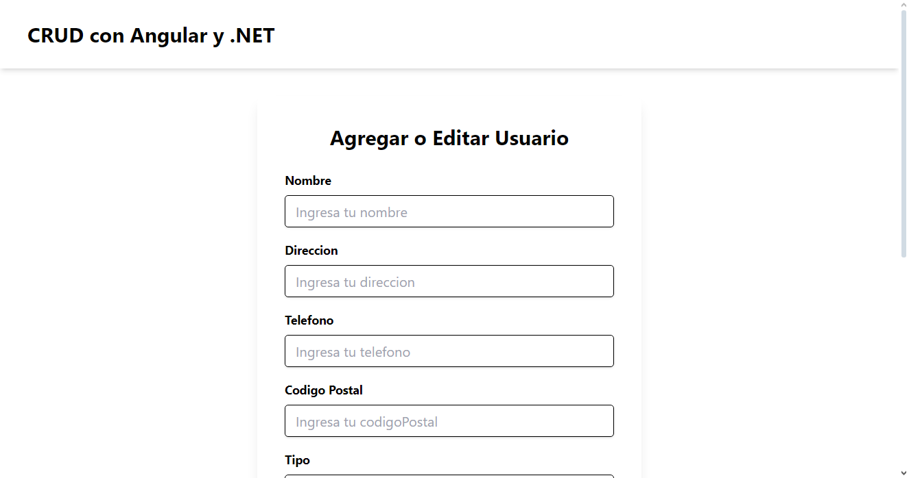

# CRUD Application with ASP.NET Core and Angular

## Overview

    
    
    

This repository contains a simple CRUD (Create, Read, Update, Delete) application developed to practice with .NET 8. The backend is built with ASP.NET Core, and the frontend is created using Angular 17. The project demonstrates a basic implementation of a full-stack application with the following features:

- Development of the backend API using ASP.NET Core.
- Usage of stored procedures with SQL Server instead of use Entity Framework.
- Full CRUD functionality (Create, Read, Update, Delete) implemented.
- Frontend developed with Angular 17.
- Simple login functionality that verifies the user's existence in the database and matches the password.
- Passwords are hashed before being stored in the database.
- Styling of the frontend using Material and TailwindCSS.

## Features

### Backend

- **ASP.NET Core API**: The backend API is developed using ASP.NET Core, providing endpoints for the CRUD operations.
- **Stored Procedures**: Instead of using Entity Framework, stored procedures are utilized to interact with the SQL Server database, enhancing performance and control.
- **Password Hashing**: Passwords are hashed before being saved to ensure security and protect user information.

### Frontend

- **Angular 17**: The frontend is built using Angular 17, providing a modern and responsive user interface for the CRUD operations.
- **Login Functionality**: A simple login system is implemented, where user credentials are verified against the database, and passwords are matched securely.
- **Styling**: The frontend is styled using Material and TailwindCSS to ensure a clean and user-friendly interface.

